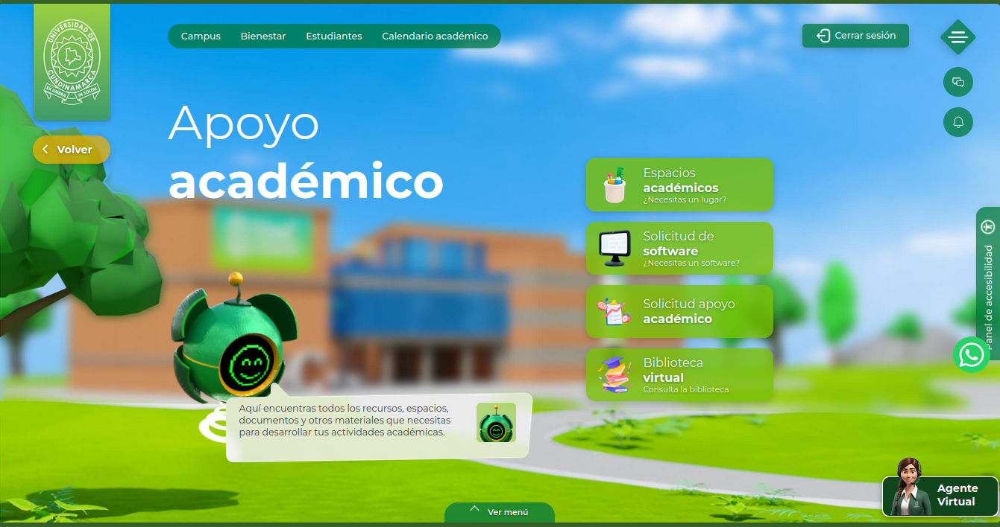
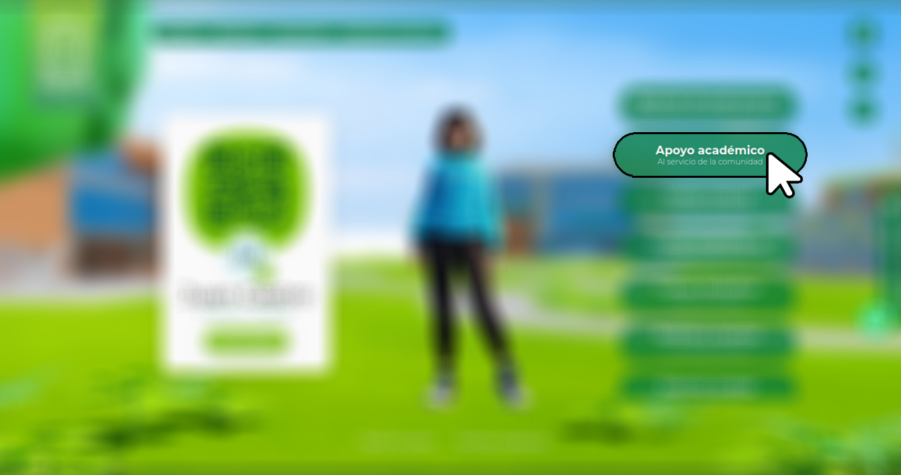
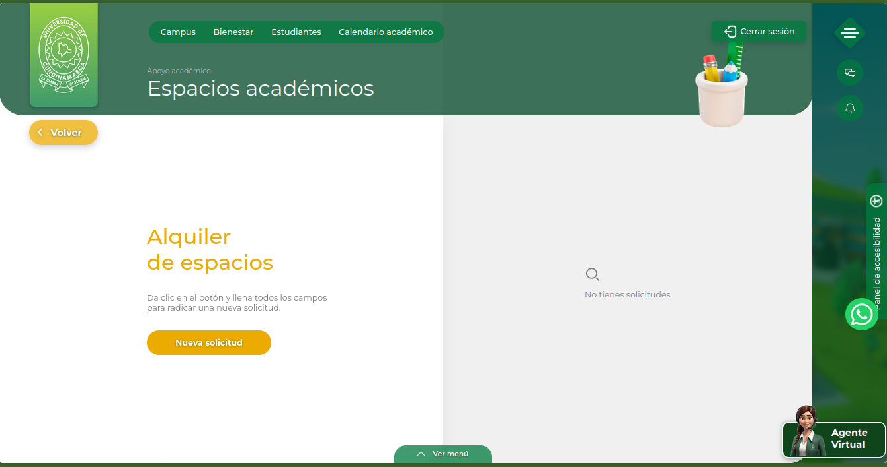
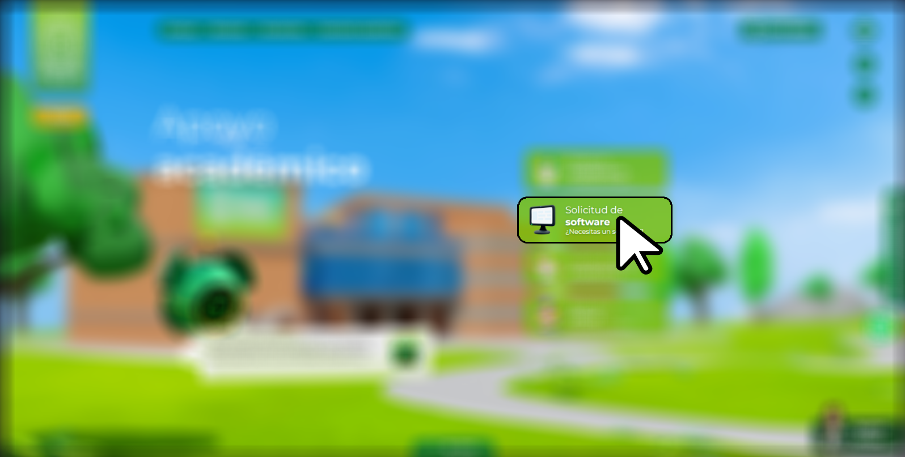
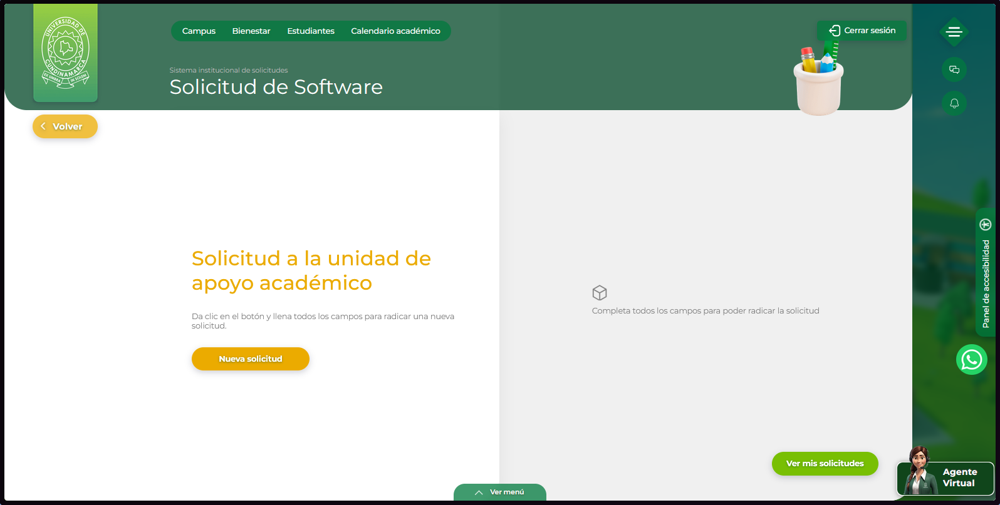
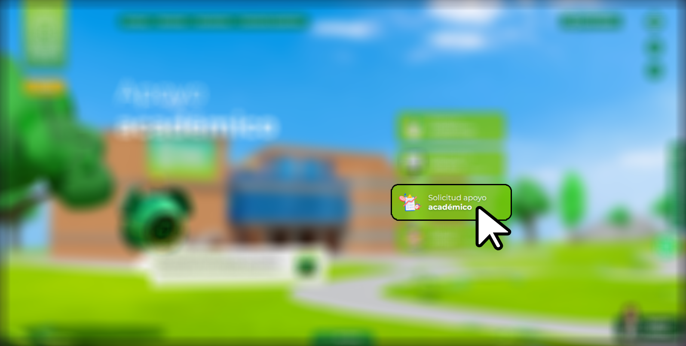
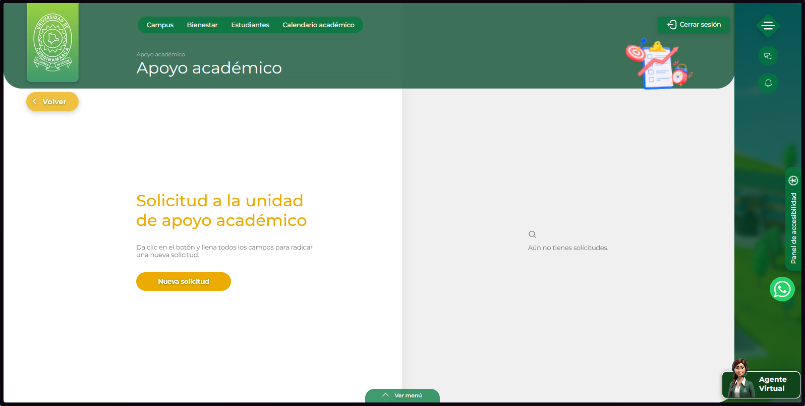
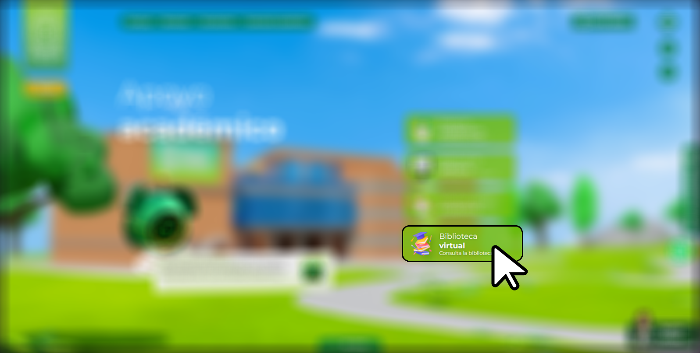
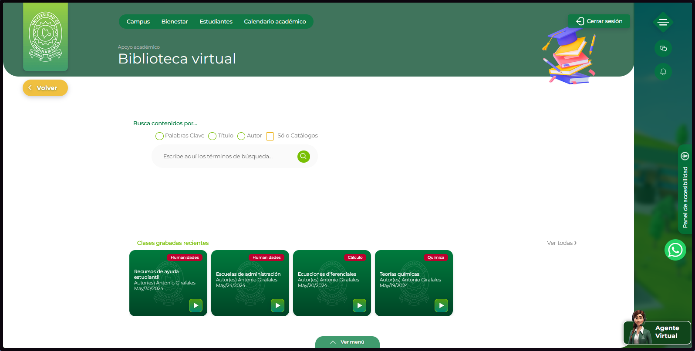

---
tags:
  - Estudiantes
  - Académico
  - Recomendación
  - Tutorial
---

# Apoyo académico

Necesitas solicitar un espacio, algun software, necesitas consultar algun libro o necesitas una tutoria con tu tesis. No dudes en entrar al modulo de apoyo académico.

<figure markdown="span">
  { loading=lazy width="75%"}
  <figcaption>Modulo - Apoyo Academico</figcaption>
</figure>

Este lo encontraras en el menu principal.

<figure markdown="span">
  { loading=lazy width="75%"}
  { loading=lazy width="75%"}
</figure>

## Espacios académicos

Solicita salones o areas para llevar tu proyecto o evento a otro nivel. Recuerda ser puntual con la hora de entrega del espacio.

<figure markdown="span">
  { loading=lazy width="75%"}
  { loading=lazy width="75%"}
</figure>

## Solicitud de software

En caso que necesites un software especializado para la elaboracion de tus tareas o proyectos, genera una solicitud y obten una licencia de forma accesible y sin costos adicionales.

<figure markdown="span">
  { loading=lazy width="75%"}
  { loading=lazy width="75%"}
</figure>

## Solicitud apoyo académico

Este es el modulo abarca necesidades tanto academicas como de bienestar que necesites. Sea tutoria para acceder a material como bases de datos, gestores bibliograficos, dispositivos de lectura a servicios para personas discapacitadas o tutorias presenciales y/o virtuales para llevar tu proyecto de una manera optima.

<figure markdown="span">
  { loading=lazy width="75%"}
  { loading=lazy width="75%"}
</figure>

## Biblioteca Virtual

Si necesitas revisitar alguna clase virtual o un material academico, no dudes en usar la barra de busqueda de la biblioteca virtual.

<figure markdown="span">
  { loading=lazy width="75%"}
  { loading=lazy width="75%"}
</figure>
