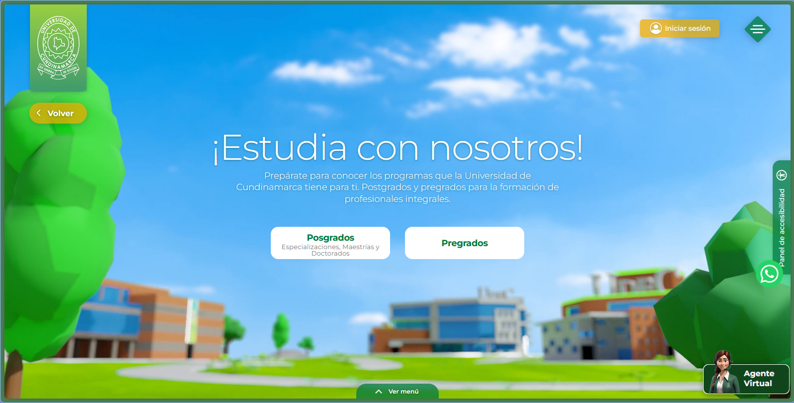
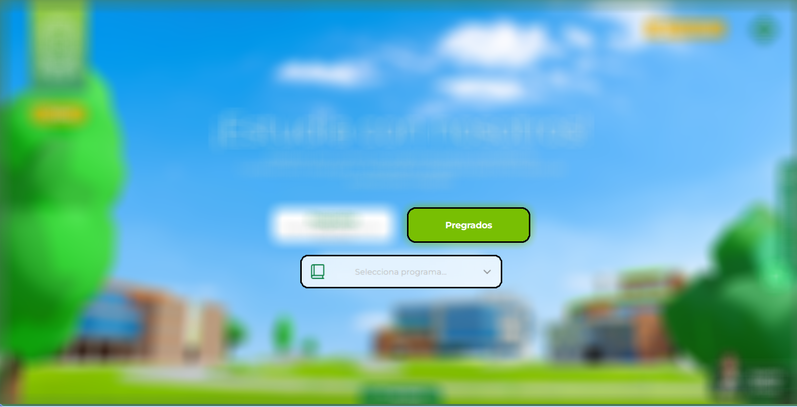
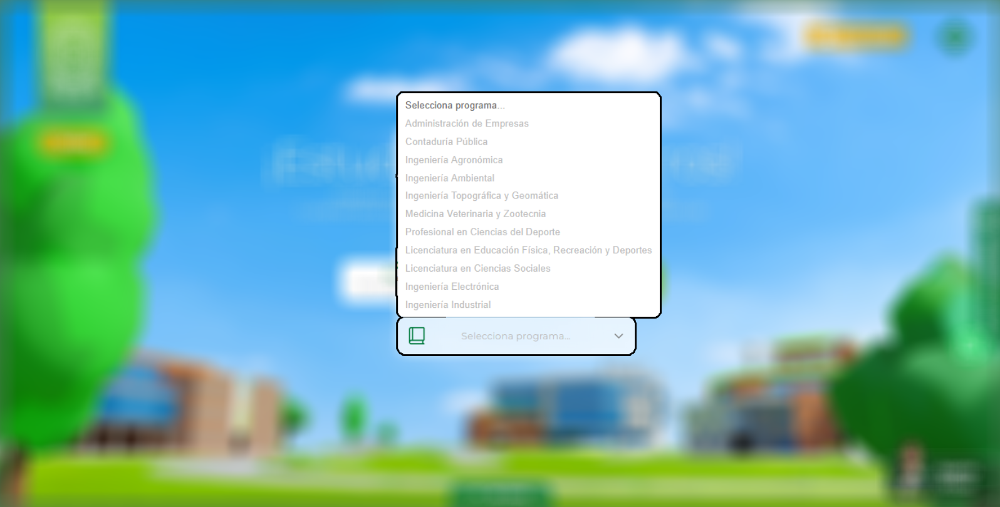
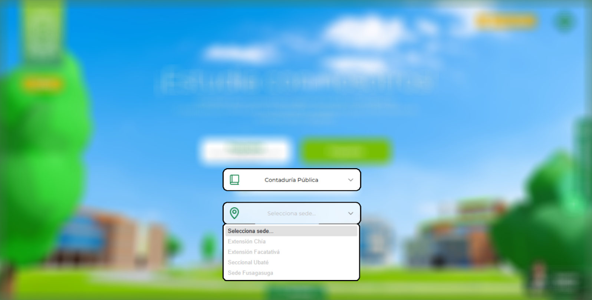
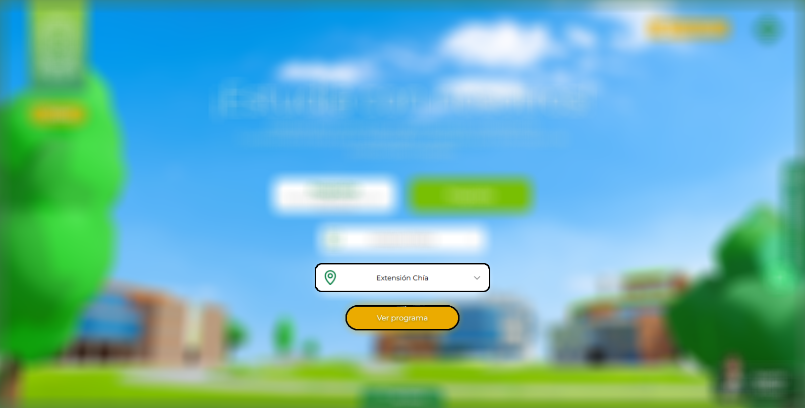
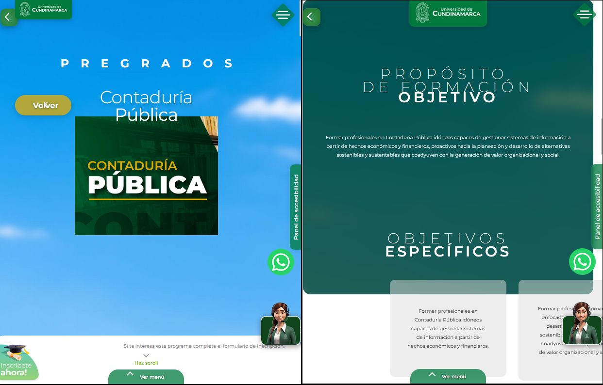

---
tags:
  - Aspirantes
  - Académico
  - Tutorial
---

# Estudia con nosotros

Sección especializada para la busqueda de tu proxima carrera y/o especialización. Como aspirante podras encontrar toda la informacion relevante para tu formación.

Pulse o haga clic en la siguiente imagen para acceder directamente a la sección.

<figure markdown="span">
  [{ loading=lazy width="80%"}](https://campus.ucundinamarca.edu.co/estudia-con-nosotros)
  <figcaption>Página Principal - Estudia con nosotros</figcaption>
</figure>

## Programas disponibles

En la Universidad de Cundinamarca cuentan tanto con carreras profesionales (pregrado) como especializaciones (posgrado).

<figure markdown="span">
  { loading=lazy width="75%"}
  <figcaption>Programas disponibles - Versión escritorio</figcaption>
</figure>

## Escoge tu carrera

Despues de elegir el tipo de programa se desplegara una lista para escoger el área de tu interes.

<figure markdown="span">
  { loading=lazy width="75%"}
  { loading=lazy width="75%"}
  <figcaption>Escoge tu carrera</figcaption>
</figure>

### Extensión

Al momento de haber escogido tu carrera, encontraras otro listado que permitira saber en que extensiones se encuentra disponible.

<figure markdown="span">
  { loading=lazy width="75%"}
  <figcaption>Escoge la extensión</figcaption>
</figure>

### Revisar contenido

<figure markdown="span">
  { loading=lazy width="75%"}
  <figcaption>Revisar contenido del prográma académico</figcaption>
</figure>

En la presentación del programa encontraras:

- Objetivos
- Perfiles académicos
- Personal administrativo
- Personal docente

<figure markdown="span">
  { loading=lazy width="75%"}
  <figcaption>Contenido Prográma Académico - Contaduria Pública</figcaption>
</figure>

De esta forma tener una idea más clara del enfoque otorgado por la Universidad de Cundinamarca.

### Descargar pensum

En caso que necesites ver el plan de estudio, lo puedes descargar en formato PDF, este siempre se encontrara en la sección "ENLACES RELACIONADOS". Este archivo contendra las materias de todo tu trayectoria por la facultad, la cantidad de creditos de cada una y cuantos semestres tiene el programa.

## Formulario inscripción

Cuando estes seguro de tu elección, solo dirigete a la parte superior en la presentación del programa y encontras el boton para mandar tu inscripción. Este te redirija a un formulario para llenar con tus datos personales. Luego de haber finalizado mantente atento al correo y telefono registrado para que un asesor te contacte en el menor tiempo posible.
