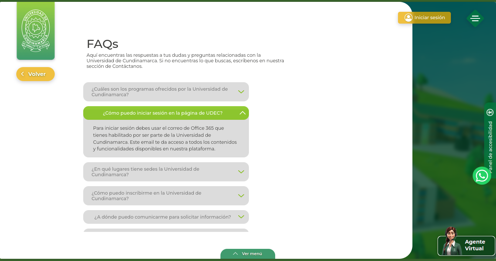
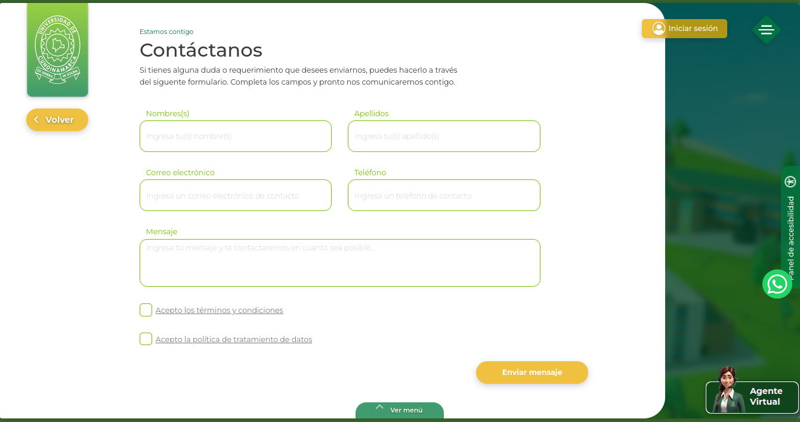

---
tags:
  - Aspirantes
  - Soporte
  - Preguntas
  - Tutorial
---

# Soporte Aspirantes

¿Tienes dudas o inconvenientes como aspirante? no te preocupes, en este apartado encontras las diversas herramientas disponibles para tener una mejor guia en tu proceso.

Recuerda que todos estos apartados los encontraros en el menu principal del campus, para ingresar a este solo deberas seleccionar el icono situada en la parte superior al lado derecho de tu pantalla.

<figure markdown="span">
  { loading=lazy width="75%"}
</figure>

## Dudas

Si tienes dudas muy generales, no olvides que la Universidad de Cundinamarca cuenta con una sección de FAQS enfocada en las dudas mas comunes

<figure markdown="span">
  { loading=lazy width="75%"}
  { loading=lazy width="75%"}
</figure>

## Contactanos

En caso de tener una duda mas concreta, puedes contactar con la universidad de cundinamarca, luego de llegar el formulario "Contáctanos" se comunicaran contigo lo mas pronto posible para resolver tus inconvenientes.

<figure markdown="span">
  { loading=lazy width="75%"}
  { loading=lazy width="75%"}
</figure>
