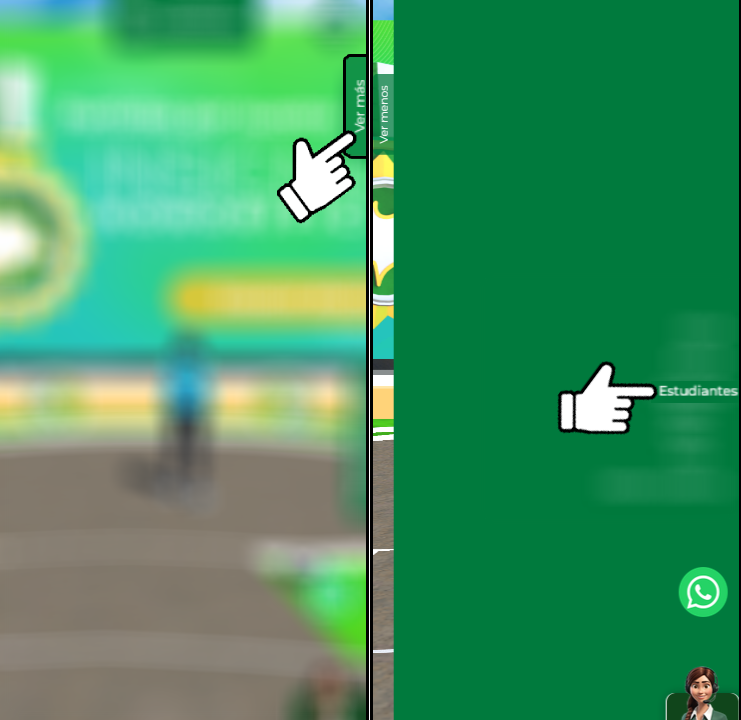

---
tags:
  - Estudiantes
  - Bienestar
  - Tutorial
---

# Modulo de bienestar

Para ingresar al modulo de bienestar recuerda ingresar por el menu superior del campus.

<figure markdown="span">
  { loading=lazy width="80%" }
</figure>

En caso de estar en movil este menu se encuentra en la sección "Ver más".

<figure markdown="span">
  { loading=lazy width="70%" }
</figure>

El modulo cuenta con distintas secciones según tus necesidades.

<figure markdown="span">
  { loading=lazy width="80%" }
</figure>
