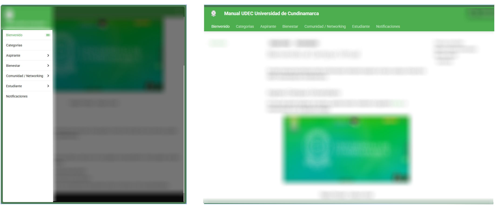
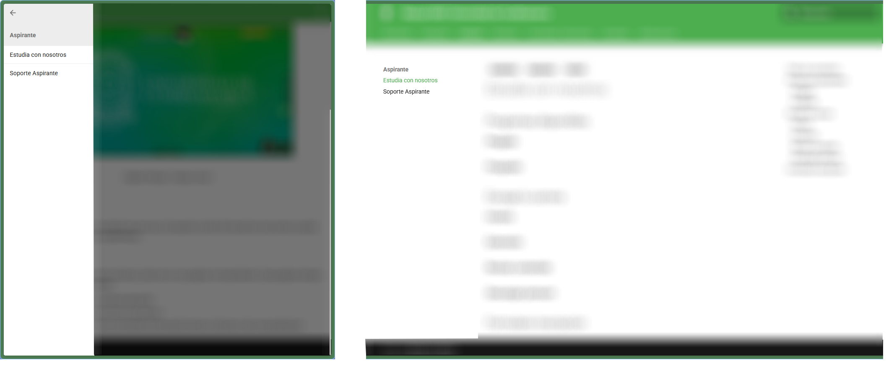
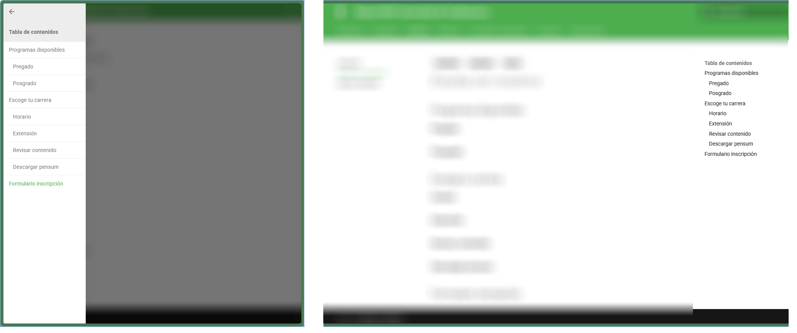

---
tags:
  - Campus virtual
  - Recomendacion
---

# Bienvenido al Campus Virtual

En este manual encontraras toda la información relevante respecto al nuevo campus virtual de la UDEC Universidad de Cundinamarca.

## Ingreso Campus Universitario

En caso de querer ingresar al campus, puedes hacerlo mediante el siguiente [enlace](https://campus.ucundinamarca.edu.co/) o interactuando con la siguiente imagen.

<figure markdown="span">
  [{ loading=lazy width="80%" }](https://campus.ucundinamarca.edu.co/)
  <figcaption>Página Principal - Campus virtual</figcaption>
</figure>

## Uso del manual

Ten en cuenta las siguientes recomendaciones para que tu busqueda a través del manual sea mas amena y puedas encontrar la solucion a tu duda y/o problematica.

### Estructura

El manual se divide a través de varias secciones, cada una con sus paginas correspondientes. Estas paginas siempre contaran con los siguientes elementos

- Secciones: Apartados según tematicas generales
<figure markdown="span">
  { loading=lazy width="80%" }
</figure>
- Temas: Aspectos especificos en torno a una seccion
<figure markdown="span">
  { loading=lazy width="80%" }
</figure>
- Subtemas: Detalles de cada tema, concretando la información entorno a informar o dar recomendaciones
<figure markdown="span">
  { loading=lazy width="80%" }
</figure>

<!-- ## Project layout

    mkdocs.yml    # The configuration file.
    docs/
        index.md  # The documentation homepage.
        ...       # Other markdown pages, images and other files. -->
