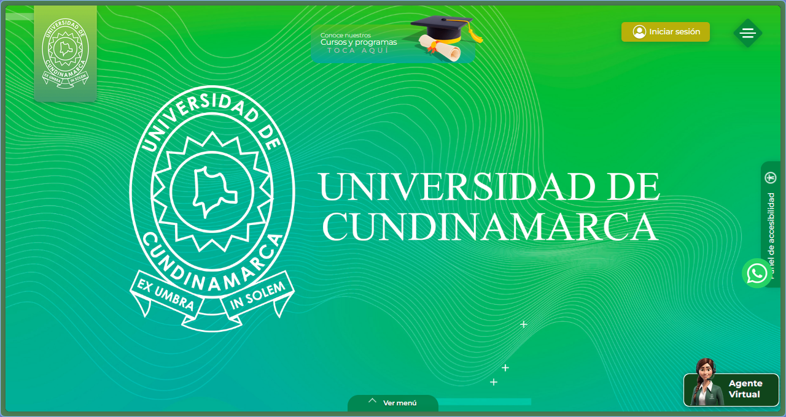
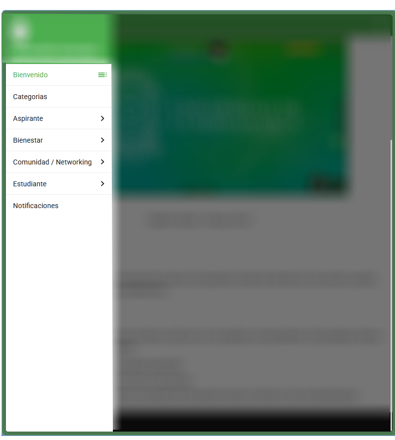
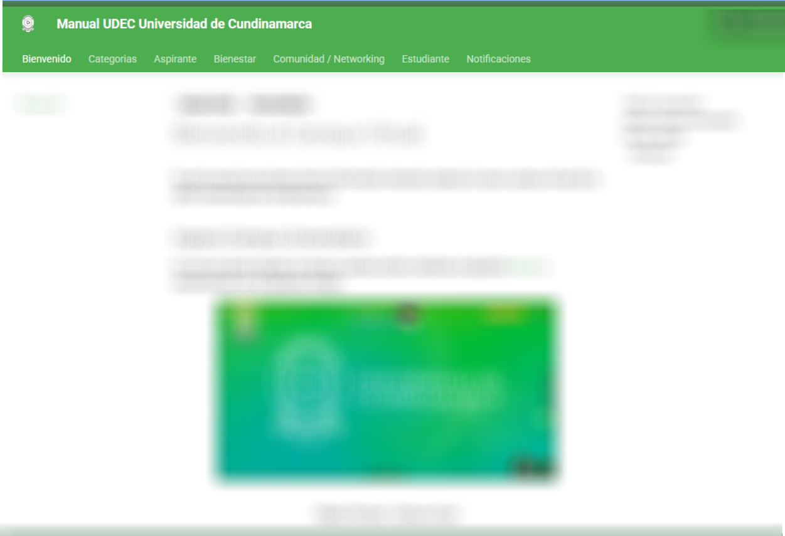
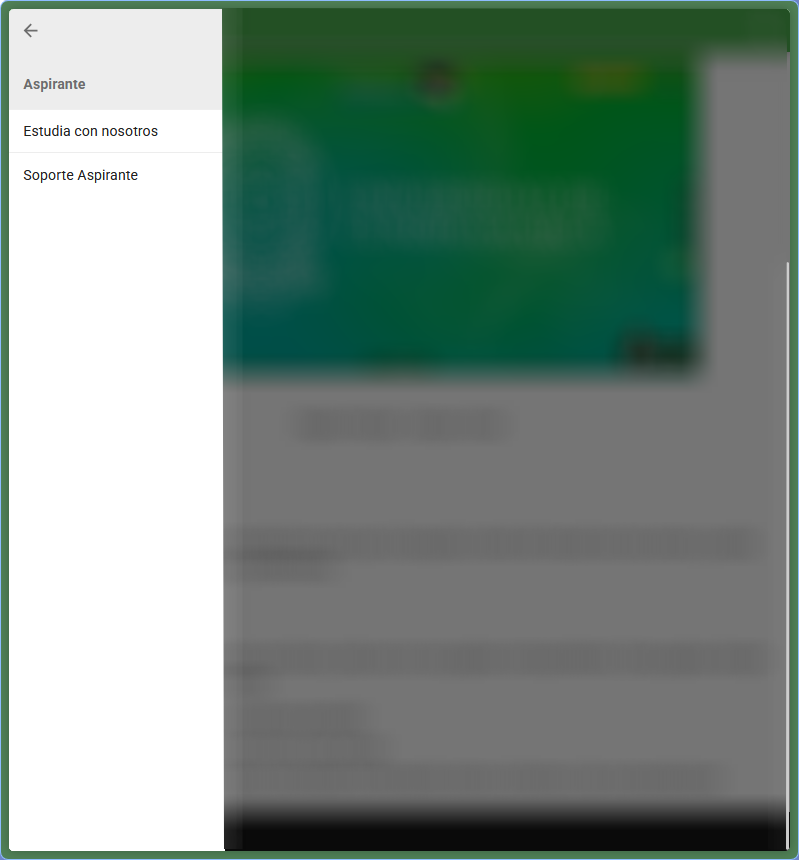
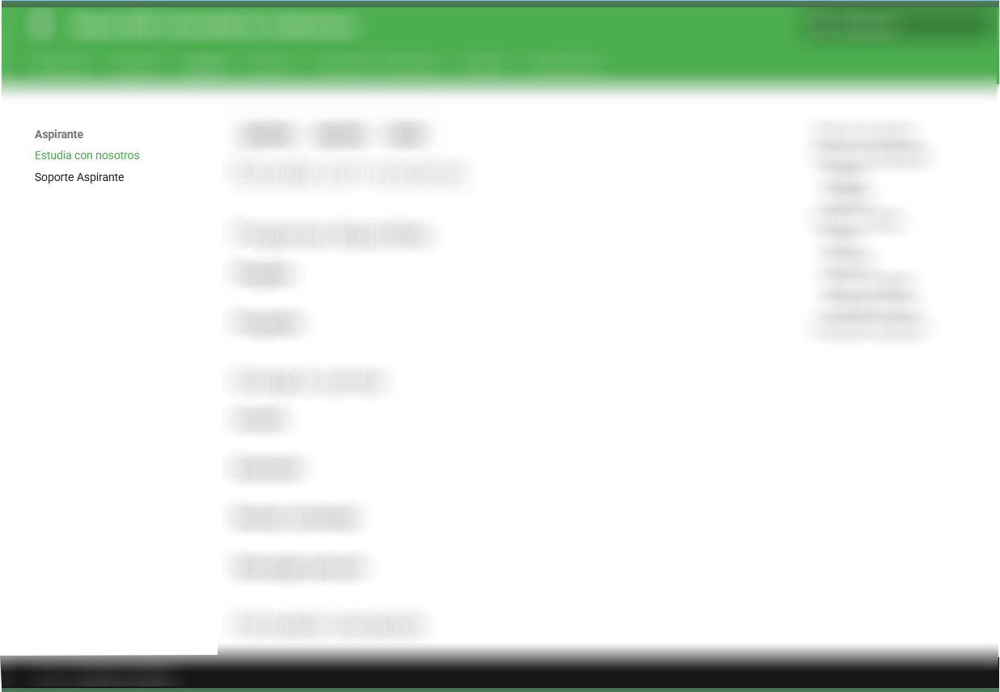
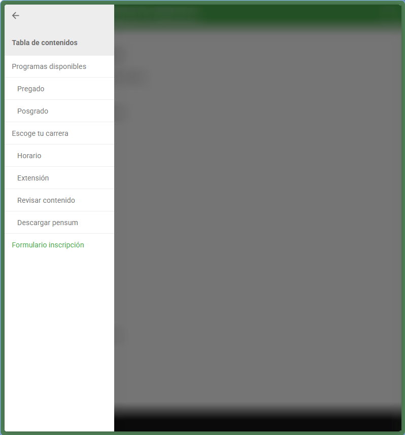
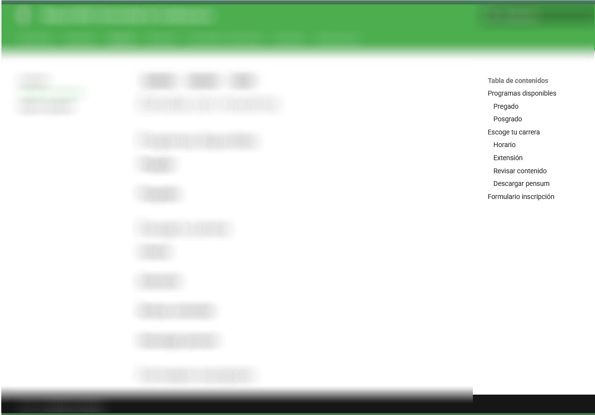
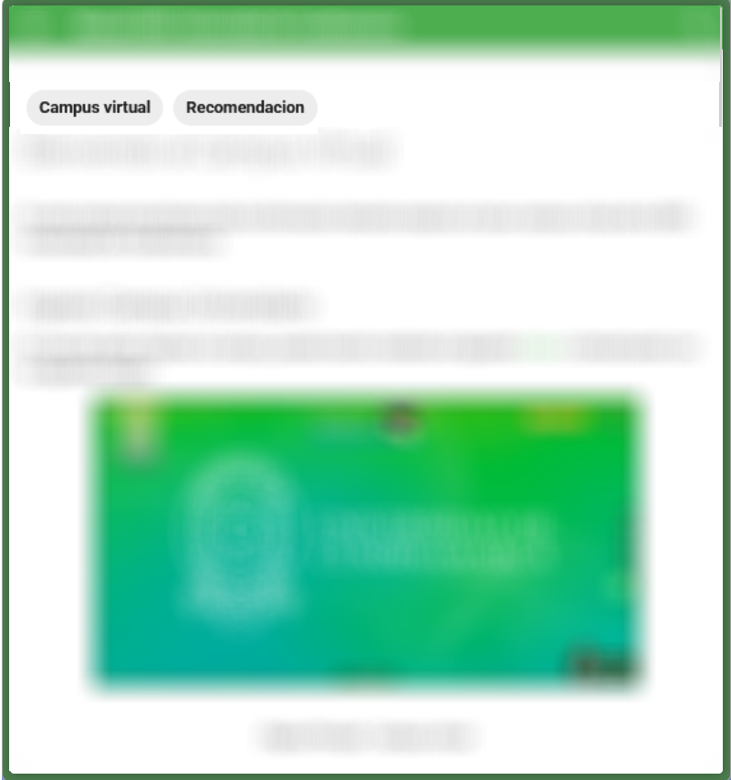
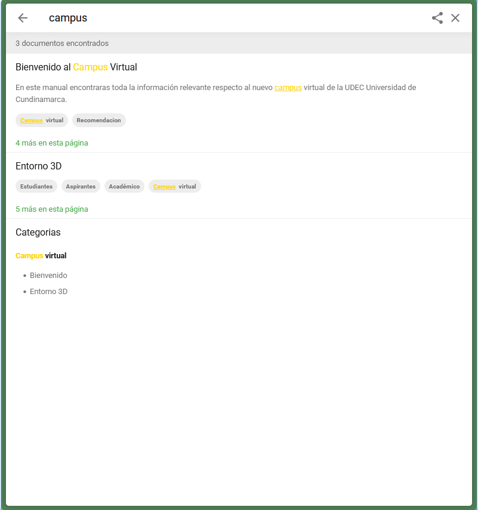

---
tags:
  - Campus virtual
  - Recomendación
---

# Bienvenido al Campus Virtual

En este manual encontraras toda la información relevante respecto al nuevo campus virtual de la UDEC Universidad de Cundinamarca.

## Ingreso Campus Universitario

En caso de querer ingresar al campus, puedes hacerlo mediante el siguiente [enlace](https://campus.ucundinamarca.edu.co/) o interactuando con la siguiente imagen.

<figure markdown="span">
  [{ loading=lazy width="80%" }](https://campus.ucundinamarca.edu.co/)
  <figcaption>Página Principal - Campus virtual</figcaption>
</figure>

## Uso del manual

Ten en cuenta las siguientes recomendaciones para que tu busqueda a través del manual sea mas amena y puedas encontrar la solucion a tu duda y/o problematica.

### Estructura

El manual se divide a través de varias secciones, cada una con sus paginas correspondientes. Estas paginas siempre contaran con los siguientes elementos

- Secciones: Apartados según tematicas generales
<figure markdown="span">
  { loading=lazy width="70%" }
  <figcaption>Secciones - Versión movil</figcaption>
  
  { loading=lazy width="85%" }
  <figcaption>Secciones - Versión escritorio</figcaption>
</figure>
- Temas: Aspectos especificos en torno a una seccion
<figure markdown="span">
  { loading=lazy width="70%" }
  <figcaption>Temas - Versión movil</figcaption>
  
  { loading=lazy width="85%" }
  <figcaption>Temas - Versión escritorio</figcaption>
</figure>
- Subtemas: Detalles de cada tema, concretando la información entorno a informar o dar recomendaciones
<figure markdown="span">
  { loading=lazy width="70%" }
  <figcaption>Subtemas - Versión movil</figcaption>
  
  { loading=lazy width="85%" }
  <figcaption>Subtemas - Versión escritorio</figcaption>
</figure>

### Categorias

Toda página cuenta con una o mas categorias indexadas, estas se representan por medio de etiquetas, se pueden visualizar en la parte superior de la página, antes del titulo.

Al interactuar con cada etiqueta te redirige al listado de categorias.

<figure markdown="span">
  { loading=lazy width="70%" }
  <figcaption>Categorias - Sección Bienvenido</figcaption>
</figure>

### Busqueda y filtrado

En la parte superior a la derecha encontraras una lupa, la cual hace parte de la sección de busqueda. Esta se encargara de filtrar el contenido, teniendo en cuenta la aparición de estos terminos claves en títulos, categorias o en el propio contenido de las páginas.

<figure markdown="span">
  { loading=lazy width="70%" }
  <figcaption>Busqueda con el termino "campus"</figcaption>
</figure>

<!-- ## Project layout

    mkdocs.yml    # The configuration file.
    docs/
        index.md  # The documentation homepage.
        ...       # Other markdown pages, images and other files. -->
